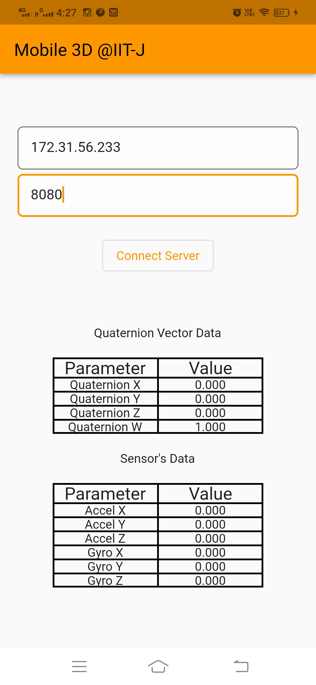
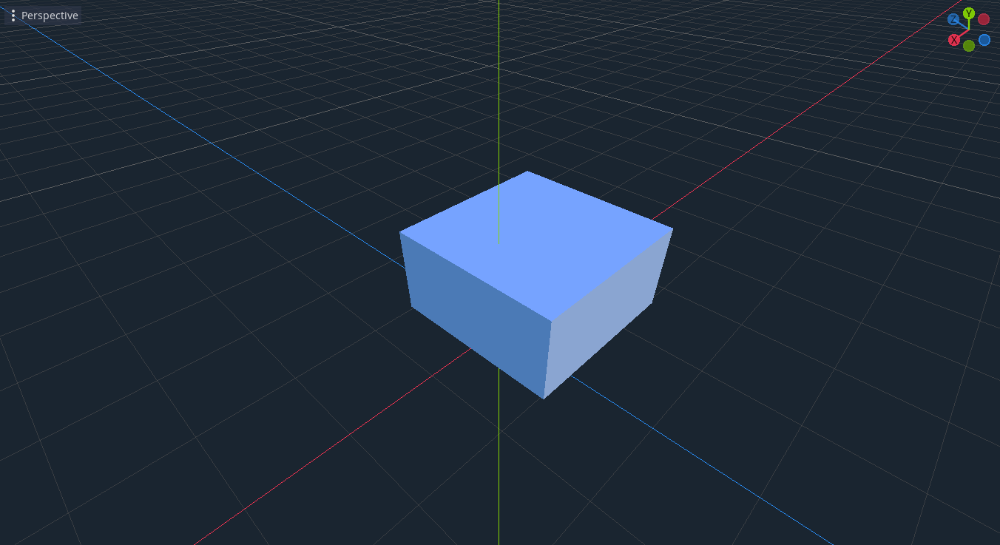
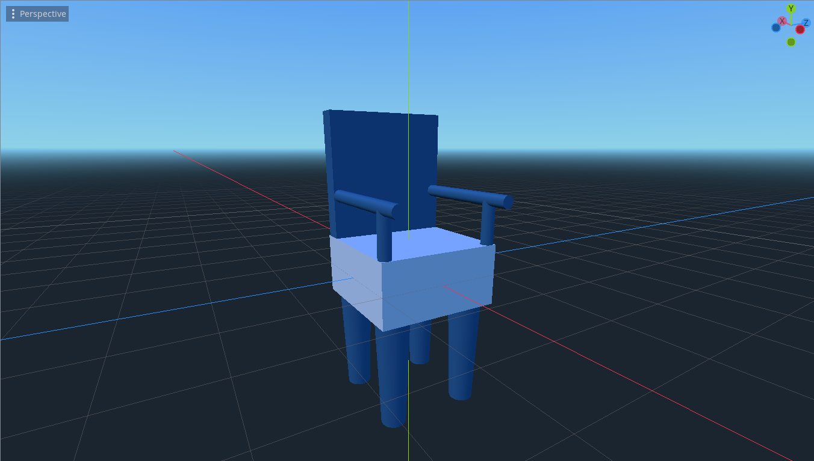

# 3D Object Manipulation using smartphone sensors

## Overview
The Mobile 3D Object Manipulation project aims to enable users to manipulate 3D objects in using mobile sensors. The goal is to provide a more intuitive and interactive way for users to interact with 3D objects in real-time, enhancing their e-commerce product viewing experience.

## Problem Statement
The field of mobile and pervasive computing has seen advancements in smartphone sensors, but there is still room for innovation in 3D object manipulation. Traditional methods such as using a mouse or touch screen lack the natural and intuitive interaction that mobile sensors can provide. The project addresses this challenge by leveraging smartphone sensors like the accelerometer and gyroscope to allow users to rotate 3D objects in real-time, enhancing the product visualization experience in e-commerce.

## Design and Architecture
Frontend : 



Godot Objects :




## Dependencies
- Dart: The programming language used for the project.
- Flutter: The framework used for building the mobile application.
- web_socket_channel: A Dart package for WebSocket communication.
- sensors: A Flutter plugin for accessing mobile sensors.
- home: Data Retrieving and Front-end.
- math: The mathematical library for mathematical operation.
- material: Flutter widget proving Material Design.

## :rocket: Technologies

* [Flutter](https://flutter.dev/)
* [Godot](https://godotengine.org/)

## :electric_plug: Prerequisites
  
- [Flutter (>= 2.0.x)](https://flutter.dev/docs/get-started/install)
- [Godot (>= 3.x)](https://godotengine.org/download/)

## Implementation
The project consists of a mobile application developed using Flutter. It utilizes the accelerometer and gyroscope sensors to track the device's movement and orientation.Mobile devices used as clients which have inbuilt Accelerometer and Gyroscope. 
First establish a web socket connection between client and game engine for real time messaging. Then start the service of object manipulation, which will read values from Accelerometer and Gyroscope sensors using the functions/methods provided in the library (sensors.dart) in Dart.

Retrieved data is then passed to the custom processor called Attitude and Heading Reference System (AHRS). It is a system that integrates multi-axes, accelerometers, gyroscopes to provide estimation of an object's orientation in space. It is basically a Quaternion Vector representing the orientation of a 3D object in 3D space. Quaternion vector is a 4 dimension vector which is used for efficient rotational calculations as sometimes the game engine does not work properly when we work with degrees and radians. The problem with other schemes like Euler angles is that different triplets can result in the same orientation and hence creating ambiguity, it also solves the problem of gimbal lock, hence we have used a quaternion vector. It also estimates the direction of gravity to measure the relative acceleration of an object.

For relative acceleration purposes,the Gravitational component from the accelerometer reading was excluded. By subtracting the gravitational force acceleration,device's linear acceleration was isolate which caused by its movement or orientation, without the influence of gravity. This is necessary for accurate tracking and manipulation of 3D objects because we are primarily interested in the device's motion and orientation changes.Subtracting the gravitational force acceleration allows us to focus on the dynamic components of the device's acceleration, which are relevant for determining its orientation and motion. It helps in obtaining more precise and meaningful data for calculations related to 3D object manipulation, such as quaternion vector calculations.
Once a client gets this quaternion vector it sends it to the game server via web sockets. Server collects those values and applies them to the 3D object. 


## Usage/Applications
1. E-commerce
2. Gaming
3. Education
4. Film and TV
5. Animation

## Future Work
There are several areas for future improvement and expansion, including:
- Integration with augmented reality for a more immersive experience.
- Collaboration and multi-user interaction for shared object manipulation.
- Fine-grained control and haptic feedback to enhance user interaction.
- Performance optimization for smoother and real-time object manipulation.
- Application expansion to other domains beyond e-commerce.

## Instructions for running code
1. Clone the repository
2. Navigate to the project directory: `cd object_manipulation_3d_flutter`
3. Install dependencies: `flutter pub get`
4. Connect your mobile device or emulator.
5. Run the application: `flutter run`
6. Start Godot and connect server

* With the application installed on your device, first make a connection to the WebSocket server from Godot, your device must be connected via wi-fi on your network, as it is a local network communication. The IP of the server is the same as that of your machine, the port is fixed at 8080. With this information, connect to the server and start capturing the data from the sensors and transmitting them over the network .

Check IP
```shell
/* windows */
$ ipconfig
```
```shell
/* linux */
$ ifconfig
```

